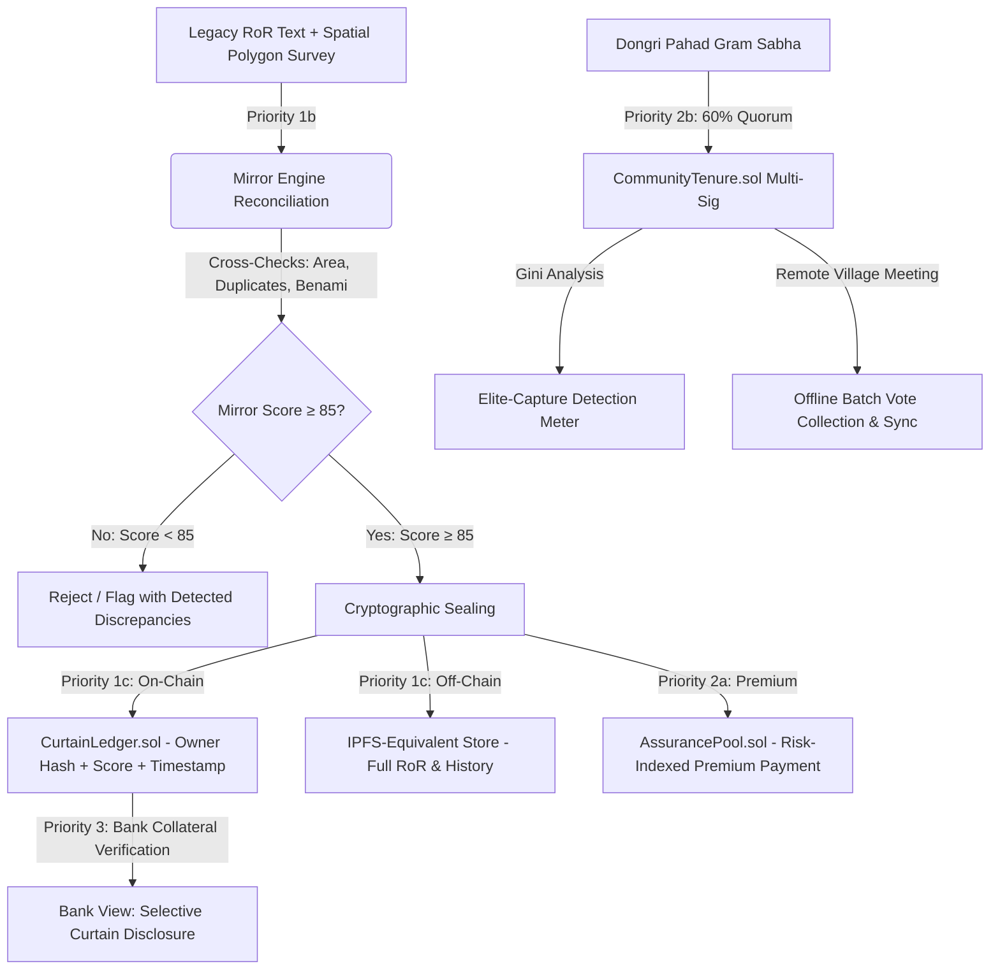

# Bhoomi Setu (भूमि सेतु)
### An Integrated GIS-based Digital Public Infrastructure for Land Governance
**Smart India Hackathon 2026 — Problem Statement SIH26014**  
*Ministry of Rural Development, Department of Land Resources (India)*

[](https://opensource.org/licenses/MIT)
[](https://fastapi.tiangolo.com)
[](https://reactjs.org/)
[](https://soliditylang.org/)
[](https://hardhat.org/)
[](https://leafletjs.com/)
[](https://docs.pytest.org/)
[](https://hardhat.org/)
[](https://nodejs.org/)

---

## 📌 Executive Summary

India's land registration records are legally **presumptive**, not **conclusive**. Registration records a financial deed between parties, but does not guarantee true ownership — resulting in approximately **66% of all civil litigation in India being land-related**. 

Most existing hackathon and academic solutions mistakenly treat blockchain purely as a permanent storage layer over records that are *assumed to already be correct*. Putting an erroneous, fraudulent, or conflicting land record onto a blockchain does not fix it — it makes the error irreversible.

**Bhoomi Setu** ("Land Bridge") solves this root cause. Built around the international **Torrens Title Architecture**, Bhoomi Setu enforces three foundational title principles while bridging two critical India-specific structural gaps:

1. **Mirror Principle (Priority 1b):** The register must accurately reflect ground reality. The Mirror Engine parses Record-of-Rights (RoR) entries, reconciles stated area against satellite GeoJSON polygon surveys (Shoelace algorithm), detects duplicate claims/overlapping parcels, and flags benami ownership patterns before anything is cryptographically sealed.
2. **Curtain Principle (Priority 1c & 3):** Once verified and sealed, third parties (such as banks and buyers) verify current title validity through the cryptographic Curtain Ledger (`CurtainLedger.sol`) without exposing private 30-year mutation histories or citizen PII.
3. **Insurance Principle (Priority 2a):** A self-funding **Assurance Pool** funded by an exact **Risk-Indexed Premium** formula:
   $$\text{premium} = \text{base\_rate} \times \text{declared\_value} \times (1 + k \times (\text{threshold} - \text{mirror\_score}))$$
   Higher-confidence parcels receive insurance discounts, economically incentivizing clean ground surveys.
4. **Community Tenure Gap (Priority 2b):** Resolves the Forest Rights Act (FRA 2006) structural gap by providing a **Gram Sabha Multi-Sig Quorum** (60%) smart contract (`CommunityTenure.sol`) with **Elite-Capture Detection (Gini Coefficient)** and offline batch signature sync simulation.
5. **Cross-State Schema Diversity (Priority 4c):** Adaptive normalization mapping varied state revenue formats (UP Bigha, TN Cents, JH Decimal Acres) to a canonical ULPIN standard.

---

## 🏷️ Module Status Matrix (Honest Labeling)

| Module | Priority Tier | Technical Implementation | Status |
| :--- | :--- | :--- | :--- |
| **Synthetic Dataset Generator** | Priority 1a | Python script generating 500 parcels across 3 real-world coordinate zones (UP, TN, JH) with 15% area mismatches, 5% duplicates, benami anomalies, and FRA community schema | 🟢 **Working Prototype** |
| **Mirror Engine** | Priority 1b | FastAPI + Regex NLP + Shoelace geospatial area reconciliation + cross-parcel duplicate & benami indexer emitting 0–100 score | 🟢 **Working Prototype** |
| **Curtain Ledger** | Priority 1c | `CurtainLedger.sol` on Hardhat — enforces Mirror Score ≥ 85 threshold, stores hashed owner IDs (no raw PII) & off-chain CIDs | 🟢 **Working Prototype** |
| **Assurance Pool** | Priority 2a | `AssurancePool.sol` — implements exact risk-indexed premium formula and oracle-triggered claim payouts | 🟢 **Working Prototype** *(Self-funding mechanism, not a commercial insurance product)* |
| **Community Tenure Multi-Sig** | Priority 2b | `CommunityTenure.sol` — 60% quorum multi-sig, offline batch signature sync simulation, and Gini coefficient Elite-Capture meter | 🟢 **Working Prototype** |
| **Interactive GIS Cadastral Map** | Priority 1–3 | Reusable Leaflet + OpenStreetMap GIS map rendering GeoJSON polygons color-coded by Mirror Score with distinct FRA village boundary | 🟢 **Working Prototype** |
| **Unified Web Interface** | Priority 3 | React 18 + Tailwind CSS + Lucide with 4 role views (Sub-Registrar, Citizen, Bank, Community) and English/Hindi i18n | 🟢 **Working Prototype** |
| **Dispute-Risk GNN Pipeline** | Priority 4a | Graph topology extractor + multi-factor risk inference pipeline | 🟡 **Architecture Demo** *(Trained on synthetic graph data)* |
| **Adaptive Schema Harmonizer** | Priority 4c | Heuristic cross-state mapping across UP, TN, and JH revenue schemas | 🟡 **Architecture Demo** *(3-state proof-of-concept)* |
| **Government Shapefile Ingestion & Spatial Indexing** | Priority 4d | Ingestion of official SVAMITVA `.shp`/`.dbf` shapefiles via GeoPandas/pyogrio + Vectorized R-Tree spatial indexing (`sindex`) | 🟡 **Architecture Demo (Extended Capability)** |

---

## 🏗️ Architecture & Data Flow



---

## 🚀 Quick Start Guide

### 1. Prerequisites
- **Node.js** v18+ and `npm`
- **Python** 3.10+ and `pip`

---

### 2. One-Click Launchers (Windows)

You can launch the entire stack using the provided scripts in the repository root:
- Double-click **`start_backend.bat`** (Starts FastAPI backend on `http://127.0.0.1:8000`)
- Double-click **`start_frontend.bat`** (Starts React + Vite frontend on `http://localhost:5173`)
- Double-click **`start_contracts.bat`** (Starts Hardhat local blockchain node on `http://127.0.0.1:8545`)

---

### 3. Manual Step-by-Step Launch

#### Step A: Generate Synthetic Dataset (Priority 1a)
```bash
# From repository root:
python scripts/generate_synthetic_data.py --seed 42
```
*Generates 500 parcels across Rampur Khurd (UP), Vellore Nagar (TN), and Dongri Pahad (JH) with injected anomalies.*

#### Step B: Smart Contracts (Hardhat EVM)
```bash
cd contracts
npm install

# Run automated smart contract test suite (16 tests)
npx hardhat test
```

#### Step C: FastAPI Backend (Port 8000)
```bash
cd ../backend
pip install fastapi uvicorn pydantic httpx pytest

# Run backend pytest suite (25 tests)
python -m pytest ../tests/ -v

# Start FastAPI server
python -m uvicorn main:app --reload --port 8000
```
*API Swagger Docs available at `http://127.0.0.1:8000/docs`*

#### Step D: React Frontend (Port 5173)
```bash
cd ../frontend
npm install

# Run frontend GIS unit test suite (5 tests)
npm test

# Start Vite dev server
npm run dev
```
*Open `http://localhost:5173` in your browser.*

---

## 🧪 Comprehensive Automated Test Coverage

### 1. Python Pytest Suite (`tests/test_mirror_engine.py`) — 25 Tests Passing
- **Unit Normalization:** Conversion tables across Bigha, Biswa, Cents, Grounds, Guntha, Marla to Hectares.
- **RoR NLP Text Parsing:** Regex-based area and unit extraction on English and Devanagari templates (`[OCR-simulated input]`).
- **Spatial Shoelace Algorithm:** Polygon area calculation with latitude scaling (~20°N).
- **Exact Analytical Gini Coefficient Verification:** Tested against mathematical baselines ($G=0.0$ for perfect equality, $G=0.2667$ for standard sequence, $G=0.9$ for concentration).
- **Mirror Confidence Deductions:** Mismatches (-30), duplicates (-40), benami (-15), missing mutations (-15).
- **Score Floor Verification:** Explicit verification that multi-flag deductions strictly floor at $0$ (`max(0, 100 - total_deductions)`).
- **Schema Harmonizer Content Parsing:** Confirms `"Kisan Credit Card SBI ₹75,000"` evaluates to `encumbrance_flag: True` and `"Nil"` to `False`.

### 2. Hardhat Smart Contract Suite (`contracts/test/bhoomi-setu.test.js`) — 16 Tests Passing
- **`CurtainLedger.sol`:** Sealing gating guard (score $\ge 85$), mutation re-verification, admin access control, selective Curtain state disclosure.
- **`AssurancePool.sol`:** Risk-Indexed Premium formula curve at threshold ($1.0\times$), high-confidence discount ($0.5\times$), and formula surcharge verification ($1.25\times$); oracle claim filing & 30% pool payout.
- **`CommunityTenure.sol`:** 60% multi-sig quorum auto-execution, **explicit `hasMemberSigned` view getter fix**, duplicate signature rejection, and offline batch vote processing.

### 3. GIS Leaflet Map Suite (`frontend/test/map-coordinates.test.js`) — 5 Tests Passing
- **GeoJSON Format Inversion:** Accurately transforms `[lon, lat]` GeoJSON arrays to Leaflet `[lat, lon]`.
- **Geographic Placement:** Asserts real-world ground placement for Rampur Khurd (UP, $\approx 25.89^\circ\text{N}, 81.98^\circ\text{E}$), Vellore Nagar (TN, $\approx 12.92^\circ\text{N}, 79.13^\circ\text{E}$), and Dongri Pahad (JH, $\approx 23.07^\circ\text{N}, 85.28^\circ\text{E}$).
- **National Bounding Box:** Asserts that all computed coordinates lie strictly within sovereign Indian territory.

---

## 📂 Repository Structure

```
bhoomi-setu/
├── backend/                        # FastAPI REST API & Core Engines
│   ├── main.py                     # API routing & dependency injection
│   ├── mirror_engine.py            # Priority 1b: Mirror Engine reconciliation & Gini math
│   ├── off_chain_store.py          # IPFS-equivalent content-addressed store
│   ├── web3_bridge.py              # Hardhat / Web3 JSON-RPC bridge
│   ├── gnn_model.py                # Priority 4a: Dispute-Risk GNN Pipeline POC
│   └── schema_harmonizer.py        # Priority 4c: Adaptive Schema Harmonizer POC
├── contracts/                      # Hardhat EVM Smart Contracts
│   ├── contracts/
│   │   ├── CurtainLedger.sol       # Priority 1c: Gated on-chain title sealing
│   │   ├── AssurancePool.sol       # Priority 2a: Risk-indexed premium assurance
│   │   └── CommunityTenure.sol     # Priority 2b: FRA Gram Sabha multi-sig quorum
│   ├── scripts/deploy.js           # Contract deployment script
│   └── test/bhoomi-setu.test.js    # Mocha/Chai smart contract test suite
├── frontend/                       # React 18 + Vite + Tailwind CSS Interface
│   ├── src/
│   │   ├── components/
│   │   │   ├── Header.jsx          # Navigation, language toggle & system badges
│   │   │   └── ParcelMap.jsx       # Interactive Leaflet GIS Cadastral Map
│   │   ├── views/
│   │   │   ├── RegistrarDashboard.jsx  # Sub-Registrar GIS map & reconciliation drawer
│   │   │   ├── CitizenView.jsx         # Citizen ULPIN search & cadastral viewer
│   │   │   ├── BankView.jsx            # Bank collateral verification & Curtain view
│   │   │   ├── CommunityGovernance.jsx # FRA Gram Sabha multi-sig & Gini meter
│   │   │   └── ArchitectureDemoView.jsx# Priority 4 GNN & Schema Harmonizer POC
│   │   └── utils/
│   │       ├── geoUtils.js         # Pure GIS coordinate & styling utilities
│   │       └── translations.js     # Bilingual English & Hindi translations
│   └── test/map-coordinates.test.js# Node.js GIS map coordinate unit tests
├── data/                           # 500-Parcel Cross-State Synthetic Dataset
│   ├── parcels_village_A.json      # Rampur Khurd (UP, Bigha schema)
│   ├── parcels_village_B.json      # Vellore Nagar (TN, Cents schema)
│   ├── parcels_village_C_community.json # Dongri Pahad (JH, FRA Community schema)
│   └── dataset_summary.json        # Master dataset metadata & anomaly statistics
├── docs/                           # Documentation & Presentation Artifacts
│   ├── demo_storyboard.md          # 2:45-minute timed hackathon pitch script
│   └── gis_map_verification.md     # GIS coordinate manual & automated verification guide
├── scripts/                        # Dataset generation & utility scripts
│   └── generate_synthetic_data.py  # Priority 1a synthetic generator
├── tests/                          # Backend Pytest Test Suite
│   └── test_mirror_engine.py       # 25-test unit & integration suite
├── start_backend.bat               # 1-Click Windows Backend Launcher
├── start_frontend.bat              # 1-Click Windows Frontend Launcher
├── start_contracts.bat             # 1-Click Windows Hardhat Node Launcher
├── .gitignore                      # Comprehensive Git ignore rules
├── LICENSE                         # MIT License
└── README.md                       # Master documentation
```

---

## 🎬 2-3 Minute Pitch & Demo Storyboard

A complete shot-by-shot narration storyboard aligned with the Master Research Document is available in:  
📁 [**`docs/demo_storyboard.md`**](file:///c:/Users/Sayyed%20Saifullah/.gemini/antigravity/scratch/bhoomi-setu/docs/demo_storyboard.md)

---

## ⚖️ Legal & Privacy Disclaimers

1. **Privacy:** No raw Aadhaar numbers or personal identifiers are written on-chain. Only SHA-256 derived pseudonymous hashes are stored. Detailed records reside in the off-chain IPFS-equivalent content-addressed store.
2. **Assurance Pool:** The Assurance Pool is a demonstration prototype of a self-funding title assurance mechanism. It does not constitute a licensed commercial insurance product or a sovereign guarantee.
3. **ML Models:** The Dispute-Risk GNN and Schema Harmonizer are architecture demonstrations trained on synthetic representations.

---

## 📄 License

This project is licensed under the **MIT License** — see the [LICENSE](LICENSE) file for details.
