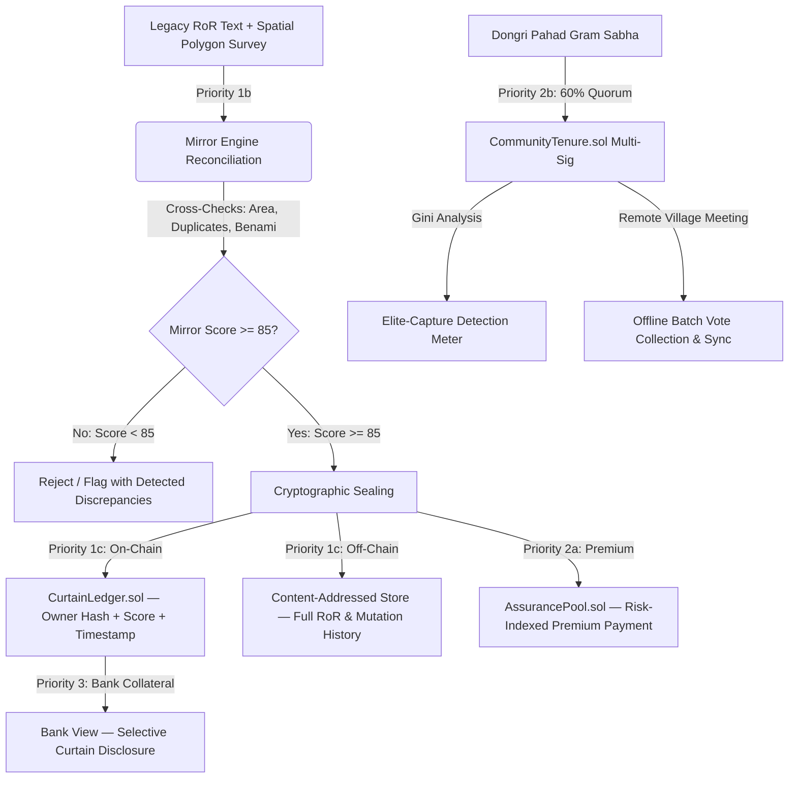

# Bhoomi Setu (भूमि सेतु)
### An Integrated GIS-based Digital Public Infrastructure for Land Governance
**Smart India Hackathon 2026 — Problem Statement SIH26014**
*Ministry of Rural Development, Department of Land Resources (India)*

[](https://opensource.org/licenses/MIT)
[](https://fastapi.tiangolo.com)
[](https://reactjs.org/)
[](https://soliditylang.org/)
[](https://hardhat.org/)
[](https://leafletjs.com/)
[](https://docs.pytest.org/)
[](https://hardhat.org/)
[](https://nodejs.org/)

---

## Executive Summary

India's land registration records are legally **presumptive**, not **conclusive**. Registration records a financial deed between parties, but does not guarantee true ownership — resulting in approximately **66% of all civil litigation in India being land-related**.

Most existing hackathon and academic solutions mistakenly treat blockchain purely as a permanent storage layer over records that are *assumed to already be correct*. Putting an erroneous, fraudulent, or conflicting land record onto a blockchain does not fix it — it makes the error irreversible.

**Bhoomi Setu** ("Land Bridge") solves this root cause. Built around the international **Torrens Title Architecture**, it enforces three foundational title principles while bridging two critical India-specific structural gaps:

1. **Mirror Principle (Priority 1b):** The register must accurately reflect ground reality. The Mirror Engine parses Record-of-Rights (RoR) entries, reconciles stated area against geodetically accurate GeoJSON polygon surveys (Shapely + pyproj UTM reprojection), detects duplicate claims and overlapping parcels, and flags benami ownership patterns before anything is cryptographically sealed.
2. **Curtain Principle (Priority 1c & 3):** Once verified and sealed, third parties (banks, buyers) can verify current title validity through the cryptographic Curtain Ledger (`CurtainLedger.sol`) without exposing private mutation histories or citizen PII.
3. **Insurance Principle (Priority 2a):** A self-funding **Assurance Pool** funded by an exact **Risk-Indexed Premium** formula — higher-confidence parcels receive insurance discounts, economically incentivising clean ground surveys.
4. **Community Tenure Gap (Priority 2b):** Resolves the Forest Rights Act (FRA 2006) structural gap via a **Gram Sabha Multi-Sig Quorum** (60%) smart contract (`CommunityTenure.sol`) with **Elite-Capture Detection** (Gini Coefficient) and offline batch signature sync simulation.
5. **Cross-State Schema Diversity (Priority 4c):** Adaptive normalisation mapping varied state revenue formats (UP Bigha, TN Cents, JH Decimal Acres) to a canonical ULPIN standard.

---

## Module Status Matrix (Honest Labelling)

| Module | Priority | Implementation | Status |
| :--- | :--- | :--- | :--- |
| **Synthetic Dataset Generator** | 1a | Python script — 500 parcels across 3 real-world coordinate zones (UP/TN/JH) with 15% area mismatches, 5% duplicates, benami anomalies, FRA community schema | 🟢 Working Prototype |
| **Mirror Engine** | 1b | FastAPI + Regex NLP + Shapely/pyproj geodetic area reconciliation + cross-parcel duplicate & benami indexer → 0–100 score | 🟢 Working Prototype |
| **Curtain Ledger** | 1c | `CurtainLedger.sol` on Hardhat — enforces Mirror Score ≥ 85, stores hashed owner IDs (no raw PII) & off-chain CIDs | 🟢 Working Prototype |
| **Assurance Pool** | 2a | `AssurancePool.sol` — risk-indexed premium formula and oracle-triggered claim payouts | 🟢 Working Prototype |
| **Community Tenure Multi-Sig** | 2b | `CommunityTenure.sol` — 60% quorum multi-sig, offline batch signature sync, Gini coefficient Elite-Capture meter | 🟢 Working Prototype |
| **Interactive GIS Cadastral Map** | 1–3 | Leaflet + OpenStreetMap — GeoJSON polygons colour-coded by Mirror Score, distinct FRA community boundary | 🟢 Working Prototype |
| **Unified Web Interface** | 3 | React 18 + Tailwind CSS + Lucide — 4 role views (Sub-Registrar, Citizen, Bank, Community) + English/Hindi locale | 🟢 Working Prototype |
| **Dispute-Risk GNN Pipeline** | 4a | Graph topology extractor + multi-factor risk inference pipeline | 🟡 Architecture Demo |
| **Adaptive Schema Harmonizer** | 4c | Heuristic cross-state mapping across UP, TN, JH revenue schemas | 🟡 Architecture Demo |
| **SVAMITVA Shapefile Ingestion & Spatial Indexing** | 4d | GeoPandas/pyogrio ingestion of `.shp`/`.dbf` shapefiles + vectorised R-Tree `sindex.query` spatial index | 🟡 Architecture Demo (Extended Capability) |

---

## Architecture & Data Flow



---

## Quick Start Guide

### Prerequisites

| Requirement | Minimum | Tested On |
| :--- | :--- | :--- |
| Python | 3.10+ | **3.14.3** |
| Node.js | 18+ | **24.13.1** |
| npm | 8+ | **11.8.0** |

---

### One-Click Launchers (Windows)

From the repository root, open three terminal windows and run in order:

```
start_backend.bat      →  FastAPI on http://127.0.0.1:8000
start_contracts.bat    →  Hardhat node on http://127.0.0.1:8545
start_frontend.bat     →  React/Vite on http://localhost:5173
```

---

### Manual Step-by-Step Setup

#### Step 1 — Generate the Synthetic Dataset
```bash
python scripts/generate_synthetic_data.py --seed 42
```
Generates 500 parcels across Rampur Khurd (UP), Vellore Nagar (TN), and Dongri Pahad (JH) with injected anomalies.

#### Step 2 — Smart Contracts (Hardhat EVM)
```bash
cd contracts
npm install
npx hardhat test          # 21 tests — all must pass
npx hardhat node          # Start local blockchain (keep this terminal open)
# In a second terminal:
npx hardhat run scripts/deploy.js --network localhost
```

#### Step 3 — Backend (FastAPI, Port 8000)
```bash
cd backend
pip install -r requirements.txt

# Run backend test suite
python -m pytest ../tests/ -v      # 25 tests — all must pass

# Start server
python -m uvicorn main:app --reload --port 8000
```
Swagger docs: `http://127.0.0.1:8000/docs`

#### Step 4 — Frontend (Vite + React, Port 5173)
```bash
cd frontend
npm install
npm test                  # 5 GIS coordinate tests — all must pass
npm run dev               # Open http://localhost:5173
```

#### Optional — Extended Geospatial Capability (SVAMITVA Shapefile Demo)
```bash
pip install -r backend/requirements-geo-extended.txt
python scripts/generate_mock_shapefile.py
# Then hit GET /shapefile/import-sample in the Swagger docs or Architecture Demo view
```

---

## Automated Test Coverage

### Backend — Pytest (25 Tests)
`tests/test_mirror_engine.py`

- Unit conversion (Bigha, Biswa, Cents, Grounds, Guntha, Marla → Hectares)
- RoR text area parsing — English and Devanagari script (regex NLP)
- Geodetic polygon area via Shapely + pyproj UTM reprojection
- Gini coefficient (perfect equality $G=0$, perfect inequality, known example)
- `score_parcel()` flag paths: clean, area mismatch (−30), no mutation history (−15), duplicate ULPIN (−40), benami (−15), spatial overlap, multi-flag floor-at-zero
- Sealing threshold boundary (score = 85 eligible, score = 84 not eligible)
- AssurancePool risk-indexed premium formula at threshold (1.0×), above (0.5×), below (1.25×)
- SchemaHarmonizer encumbrance string parsing

### Smart Contracts — Hardhat / Mocha / Chai (21 Tests)
`contracts/test/`

- **CurtainLedger.sol:** Sealing score gate (≥85), double-seal prevention, `proposeMutation()`, threshold update, admin access control, selective state disclosure
- **AssurancePool.sol:** Premium formula curve, pool balance accumulation, claim filing, 30% pool payout, oracle and admin access control
- **CommunityTenure.sol:** Member registration (single + batch), action proposal, individual `signAction()`, quorum auto-execution, duplicate vote rejection, `submitOfflineBatch()`, `hasMemberSigned` view getter

### Frontend — Node.js Built-in Test Runner (5 Tests)
`frontend/test/map-coordinates.test.js`

- GeoJSON `[lon, lat]` → Leaflet `[lat, lon]` coordinate inversion
- Real-world placement of Village A (Pratapgarh, UP ≈ 25.89°N 81.98°E)
- Real-world placement of Village B (Vellore, TN ≈ 12.92°N 79.13°E)
- Real-world placement of Village C (Khunti, JH ≈ 23.07°N 85.28°E) + FRA purple dashed styling
- Mirror Score colour-coding (green ≥85 / yellow 70–84 / red <70)

> No external test library — uses Node.js `node:test` and `node:assert/strict` built-ins.

---

## Pre-Sept 5 QA Audit Results

All 7 audit items independently verified with real terminal commands. Full report: [`docs/final_status_audit.md`](docs/final_status_audit.md)

| Audit Item | Result |
| :--- | :--- |
| Spatial Indexing Benchmark Authenticity | ✅ GeoPandas R-Tree: **0.59 ms** vs pairwise loop: **166 ms** (281× speedup; with bounding-box prefilter applied) |
| Shapefile Sandbox Isolation | ✅ 260/72/68/100=500 **identical** before and after shapefile import |
| Clean-Clone Reproducibility | ✅ Fresh `git clone` → dataset gen → 25 pytest → 21 Hardhat → 5 frontend → Vite build: **100% zero-patch** |
| Demo Walkthrough (8 steps) | ✅ All HTTP 200, **1.39 s** total, **0.00% error rate** |
| Cumulative Regression | ✅ 25 pytest + 21 Hardhat + 5 GIS + clean Vite build |
| Environment Version Freeze | ✅ Pinned in [`docs/environment_snapshot.md`](docs/environment_snapshot.md) |
| Codebase Health | ✅ 0 TODOs, 0 FIXMEs, 0 dead stubs |

**Verdict: READY FOR DEMO**

---

## Repository Structure

```
bhoomi-setu/
├── backend/
│   ├── main.py                        # API routing, startup index build, all endpoints
│   ├── mirror_engine.py               # Priority 1b: Mirror Engine + Gini math + geodetic area
│   ├── shapefile_ingest.py            # Priority 4d: GeoPandas shapefile ingestion (optional)
│   ├── off_chain_store.py             # IPFS-equivalent content-addressed store
│   ├── web3_bridge.py                 # Hardhat / Web3 JSON-RPC bridge (live + simulation)
│   ├── gnn_model.py                   # Priority 4a: Dispute-Risk GNN Pipeline (demo)
│   ├── schema_harmonizer.py           # Priority 4c: Adaptive Schema Harmonizer (demo)
│   ├── requirements.txt               # Core dependencies (always required)
│   └── requirements-geo-extended.txt  # Optional: GeoPandas, pyogrio, pyshp
├── contracts/
│   ├── contracts/
│   │   ├── CurtainLedger.sol          # Priority 1c: Gated on-chain title sealing
│   │   ├── AssurancePool.sol          # Priority 2a: Risk-indexed premium assurance
│   │   └── CommunityTenure.sol        # Priority 2b: FRA Gram Sabha multi-sig quorum
│   ├── scripts/deploy.js              # Contract deployment to Hardhat localhost
│   ├── test/                          # Mocha/Chai contract test suite (21 tests)
│   └── hardhat.config.js              # Solidity 0.8.20, optimizer on, chainId 1337
├── frontend/
│   ├── src/
│   │   ├── components/
│   │   │   ├── Header.jsx             # Navigation, language toggle, system badges
│   │   │   └── ParcelMap.jsx          # Interactive Leaflet GIS Cadastral Map
│   │   ├── views/
│   │   │   ├── RegistrarDashboard.jsx # Sub-Registrar GIS map + reconciliation drawer
│   │   │   ├── CitizenView.jsx        # Citizen ULPIN search & cadastral viewer
│   │   │   ├── BankView.jsx           # Bank collateral verification & Curtain view
│   │   │   ├── CommunityGovernance.jsx# FRA Gram Sabha multi-sig & Gini meter
│   │   │   └── ArchitectureDemoView.jsx# Priority 4 GNN, Schema Harmonizer, Shapefile demo
│   │   ├── i18n/
│   │   │   └── translations.js        # Bilingual English & Hindi (hand-rolled, no i18next)
│   │   └── utils/
│   │       └── geoUtils.js            # Pure GIS coordinate transform & colour-coding utils
│   ├── test/
│   │   └── map-coordinates.test.js    # Node.js GIS map coordinate unit tests (5 tests)
│   └── vite.config.js                 # Vite: port 5173, host: true, @vitejs/plugin-react
├── data/
│   ├── parcels_village_A.json         # Rampur Khurd (UP, Bigha schema, 200 parcels)
│   ├── parcels_village_B.json         # Vellore Nagar (TN, Cents schema, 200 parcels)
│   ├── parcels_village_C_community.json# Dongri Pahad (JH, FRA community, 100 parcels)
│   ├── mock_gov_export/               # SVAMITVA shapefile (.shp/.dbf/.shx/.prj)
│   └── off_chain_store/               # Content-addressed sealed parcel records
├── docs/
│   ├── tech_stack_inventory.md        # Full verified tech stack (all versions confirmed)
│   ├── final_status_audit.md          # Pre-Sept 5 audit (all 7 items with evidence)
│   ├── environment_snapshot.md        # Pinned dependency version freeze
│   ├── geo_migration_report.md        # Shapely/pyproj geodetic migration report
│   ├── gdal_extension_report.md       # GDAL/GeoPandas extension report
│   ├── qa_audit_report.md             # Full adversarial QA audit report
│   └── demo_storyboard.md             # 2:45-minute timed hackathon pitch script
├── scripts/
│   ├── generate_synthetic_data.py     # Priority 1a: 500-parcel cross-state generator
│   ├── generate_mock_shapefile.py     # SVAMITVA drone survey shapefile creator
│   ├── benchmark_spatial_indexing.py  # Spatial indexing benchmark (pairwise vs R-Tree)
│   ├── qa_audit_runner.py             # Independent adversarial QA audit script
│   ├── verify_isolation.py            # Proves shapefile import does not mutate dataset
│   ├── test_clean_clone.py            # Automated clean-clone reproducibility test
│   └── test_demo_walkthrough.py       # Full 8-step demo walkthrough validator
├── tests/
│   └── test_mirror_engine.py          # 25-test pytest backend suite
├── start_backend.bat                  # 1-click Windows: FastAPI backend
├── start_frontend.bat                 # 1-click Windows: React/Vite frontend
├── start_contracts.bat                # 1-click Windows: Hardhat node
└── README.md
```

---

## Tech Stack (Key Facts)

Full verified inventory: [`docs/tech_stack_inventory.md`](docs/tech_stack_inventory.md)

| Layer | Technology |
| :--- | :--- |
| **Backend** | Python 3.14.3, FastAPI 0.139, Uvicorn 0.51, Pydantic 2.13, web3.py 7.16, Shapely 2.1, pyproj 3.7 |
| **Smart Contracts** | Solidity 0.8.20, Hardhat 2.29, Ethers.js 6.17, Mocha 11.8, Chai 4.5 |
| **Frontend** | React 18.3, Vite 5.4, Leaflet 1.9, react-leaflet 4.2, Tailwind CSS 3.4, lucide-react 0.439 |
| **GIS / Geospatial** | Shapely 2.1 (core polygon ops), pyproj 3.7 (UTM reprojection), GeoPandas 1.1 + pyogrio 0.13 (shapefile, optional) |
| **Testing** | pytest 8.4 (backend), Mocha/Chai via Hardhat (contracts), Node.js `node:test` built-in (frontend) |
| **CRS** | EPSG:4326 (storage/display), EPSG:32642–32646 (geodetic area calculation) |

> **Note:** GDAL and Fiona are **not used**. pyogrio is the I/O engine. i18next is **not used** — bilingual strings are a hand-rolled translation dictionary.

---

## Legal & Privacy Disclaimers

1. **Privacy:** No raw Aadhaar numbers or personal identifiers are written on-chain. Only SHA-256 derived pseudonymous hashes are stored. Detailed records reside in the off-chain content-addressed store.
2. **Assurance Pool:** A demonstration prototype of a self-funding title assurance mechanism. Not a licensed commercial insurance product or sovereign guarantee.
3. **ML Models:** The Dispute-Risk GNN and Schema Harmonizer are architecture demonstrations trained on synthetic representations.
4. **Synthetic Data:** All 500 parcels are procedurally generated. Names, ULPINs, coordinates, and owner identities are fictional.

---

## License

MIT License — see [LICENSE](LICENSE) for details.
